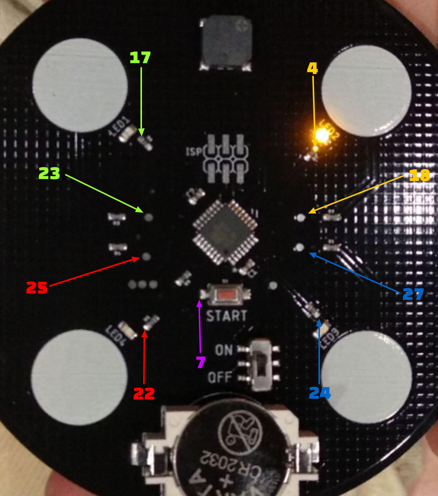

Malcon 2k18
===========


#Getting the code
1. Find speed:
 ```
$ cat ~/arduino/hardware/arduino/avr/boards.txt | grep ".upload.speed="
 ```

2. Get the dump
 ```
avrdude -p t88 -c avrisp -P /dev/ttyACM0 -b 19200 -U flash:r:malcon2018_flash.hex:r
avrdude -p t88 -c avrisp -P /dev/ttyACM0 -b 19200 -U eeprom:r:malcon2018_eeprom.hex:r
 ```


#Documents
- [ATTinyCore help](https://github.com/SpenceKonde/ATTinyCore)
- [AVR for beginners](http://www.avr-asm-tutorial.net/avr_en/beginner/index.html)
- [UART](http://www.electronics-base.com/avr-tutorials/uart)
